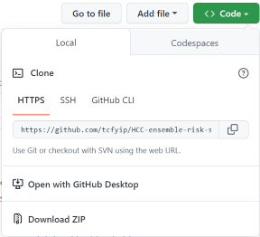

```{r setup, include=FALSE}
knitr::opts_chunk$set(echo = TRUE)
```

You can download all the files from <https://github.com/tcfyip/HCC-ensemble-risk-score>. Please click "Code" and then "Download ZIP". 

Then you can put all the downloaded files in the same directory of your local computer and run the following R codes with R installed. Or you may want to fork the whole repository to your GitHub.

## Required R packages

-   caret (v6.0-92)
-   catboost (v0.16.5)
-   devtools

```{r}
# Uncomment and install R package 'devtools' for first time usage
# install.packages('devtools', repos = "http://cran.us.r-project.org")
```

Details on the installation of catboost R package to your local computer: <https://catboost.ai/en/docs/installation/r-installation-binary-installation>

```{r}
# Uncomment and install R package 'catboost' (v0.16.5) for first time usage
# devtools::install_url('https://github.com/catboost/catboost/releases/download/v0.16.5/catboost-R-Windows-0.16.5.tgz', INSTALL_opts = c("--no-multiarch", "--no-test-load"))
```

```{r}
# Uncomment and install R package 'caret' (v6.0-92) for first time usage
# devtools::install_version("caret", version = "6.0-92", repos = "http://cran.us.r-project.org")
```

## HCC ensemble risk score

The following codes calculate the HCC ensemble risk score for a single patient.

```{r}

# Input the clinical data of a single patient as follows
# Age (years)
Age = 50
# Gender (0: Female, 1: Male)
Gender = 1
# Etiology (0: viral hepatitis, 1: non-viral hepatitis)
Etiology = 0
# Presence of diabetes (1: Yes, 0: No)
DM = 0
# Presence of hypertension (1: Yes, 0: No)
HT = 0
# Alanine aminotransferase (IU/L)
ALT = 35
# Albumin (g/L)
ALB = 42
# Total bilirubin (μmol/L)
TB = 11.1
# Alkaline phosphatase (IU/L)
ALP = 57
# Platelet (x10^9/L)
PLT = 220
# Creatinine (μmol/L)
Cr = 70.2
# Liver stiffness measurement (kPa)
LSM = 8.8

# Form a data frame
pt1 = data.frame(
  'Age'=Age, 'Gender'=Gender, 'Etiology'=Etiology, 
  'DM'=DM, 'HT'=HT, 'ALT'=ALT, 
  'ALB'=ALB, 'TB'=TB, 'ALP'=ALP, 
  'PLT'=PLT, 'Cr'=Cr, 'LSM'=LSM)

# Load necessary R packages and function
library(caret)
library(catboost)
source("ensemble.R")

# Calculate the HCC ensemble risk score
catb = readRDS("catb.rds")
rf = readRDS("rf.rds")
score = round(ensemble(list(catb, rf), pt1), 3)

paste("The HCC ensemble risk score is", score)
```

The following codes calculate the HCC ensemble risk score for a cohort of patients.

```{r}

# Remark: The data set should contain the 12 necessary columns:
# Age, Gender, Etiology, DM, HT, ALT, ALB, TB, ALP, PLT, Cr, LSM
# Please refer to above on the units and the coding of the categories

# Read in the cohort of patients in csv format
pts <- read.csv("sample cohort.csv")

# Load necessary R packages and function
library(caret)
library(catboost)
source("ensemble.R")

# Calculate the HCC ensemble risk score
catb = readRDS("catb.rds")
rf = readRDS("rf.rds")
scores = round(ensemble(list(catb, rf), pts), 3)

head(cbind(pts, scores), 10)
```
